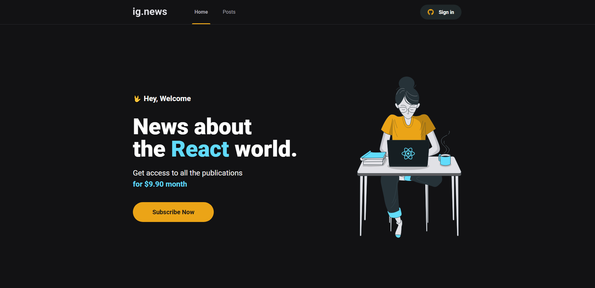
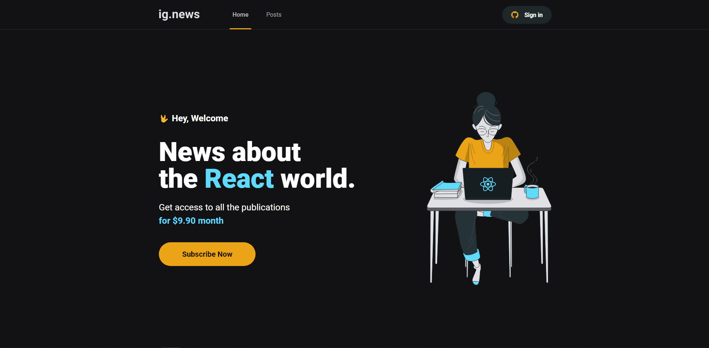

<h1 align="center">
    
</h1>
<p align="center"> 
  <p>
    O Ig.news é um aplicação onde o usuário vai poder assinar por um
    conteúdo em texto.
  </p>
 <h2>:computer: Aplicação Web</h2>

 <h3>Home</h3>
<hr>
 
 <hr>
<h3> Fluxo</h3>
 
<hr>

<h2> :bulb: Funcionalidades</h2>

* Se logar com a conta do Google e GitHub;

* Listar artigos do CMS;

* Assinatura para acompanhar os artigos;

<h2> :wrench: Pré-requisitos</h2>

 Antes de começar, você vai precisar ter instalado em sua máquina as seguintes ferramentas:
[Git](https://git-scm.com), [Node.js](https://nodejs.org/en/). Além disto é bom ter um editor para trabalhar com o código como o [VSCode](https://code.visualstudio.com/)

:rocket: Para rodar a aplicação

  ```bash

# Clone este repositório
$ git clone https://github.com/Gabriel52/IG_News

# Acesse a pasta do projeto no seu terminal/cmd
$ cd ignews

# Execute o comando na pasta ignews para instalar todas as dependências
$ npm install ou yarn

# Execute a aplicação em modo de desenvolvimento, é importante executar este comando
$ npm run dev ou yarn dev

# A aplicação web será aberta na porta:3000 - acesse http://localhost:3000

 ```

## 🛠 Tecnologias
* Next JS;
* Axios;
* Stripe
* slice machine


FaunaDB (Banco de Dados);

<h2> :book: Licença </h2>
<p>Lançado em 2022 :book:</p></br>
<p>Feito por Gabriel Brune :rocket:. Este projeto está sobre a licença do MIT</p></br>
<p>Dar uma :star: se este projeto te ajudou</p>

<h2> 🐛 Problemas</h2
<p>Sinta-se à vontade para registrar um novo problema com o respectivo título e descrição no repositório Ignews . Se você já encontrou uma solução para seu problema, eu adoraria revisar sua solicitação de pull!</p>